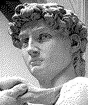
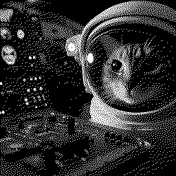
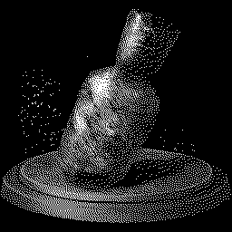
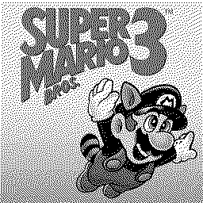

# About
I was writing a feature for another program to dither an image and set up a separate project for easier testing, and then made it into command line tool that is a bit more complete for running dithering algorithms on images.

# Dithering

Dithering is the process of adding noise to an image (often using error diffusion). A quantization error is distributed to nearby neighbours of a pixel. We end up with a dithered image with the commonly seen checkerboard dotted "noise" patterns emerging.

## Floyd-Steinberg

One of the most well known is the Floyd-Steinberg image dithering algorithm. The algorithm itself is quite simple. You scan from left to right, top to bottom, and distribute the "error" from the pixel being processed to it's closest unprocessed pixels.

``` FSharp
// process pixels starting from the top left of the image
// process in order from left to right, top to bottom
for y in 0 .. bitmap.Height - 1 do
    for x in 0 .. bitmap.Width - 1 do
        let oldPixel = bitmap.GetPixel(x, y)
        let newPixel = findClosestPaletteColor oldPixel
        bitmap.SetPixel(x, y, newPixel)
        let quantError = difference oldPixel newPixel

        // distribute the "error" to neighbouring unvisited pixels
        // to the right, bottom left, below, and bottom right pixel
        [ x + 1,  y,      7.0 / 16.0
          x - 1,  y + 1,  3.0 / 16.0
          x,      y + 1,  5.0 / 16.0
          x + 1,  y + 1,  1.0 / 16.0 ]
        |> List.iter (fun (x, y, factor) -> addError bitmap x y quantError factor)
```

Below is a few examples of images I dithered using Floyd-Steinberg dithering. Different methods are available to reduce the colour palette, but for what I wanted black-and-white dithering was perfect.






## Other Algorithms

There are many other dithering algorithms - some very similar and based on the same principle as Floyd-Steinberg 
 - Atkinson - A variant of Floyd-Steinberg that diffuses ¾ of the quantization error to neighbours. Preserving detail better, but at the cost of performance to near-white or near-black areas. 
 - Jarvis, Judice, and Ninke independently came up with the same error diffusion dithering, but diffused the quantization error to a wider range of neighbours. 
 - And more with pros and cons to the output and performance.

# Running

``` 
USAGE: ls [--help] --input-file <PATH> [--dithering-algorithm <floydsteinberg|atkinson>] [--output-path <PATH>]

OPTIONS:

    --input-file, -i <PATH>
                          specify an input file to dither.
    --dithering-algorithm, -da <floydsteinberg|atkinson>
                          specify a dithering algorith to use (default: floydsteinberg).
    --output-path, -o <PATH>
                          specify a custom output path for the dithered image (default: My Pictures).
    --help                display this list of options.

dotnet run -i "C:\image.png" 
dotnet run -i "C:\image.png" -da floydsteinberg
dotnet run -i "C:\image.png" -o "D:\Images\"
```